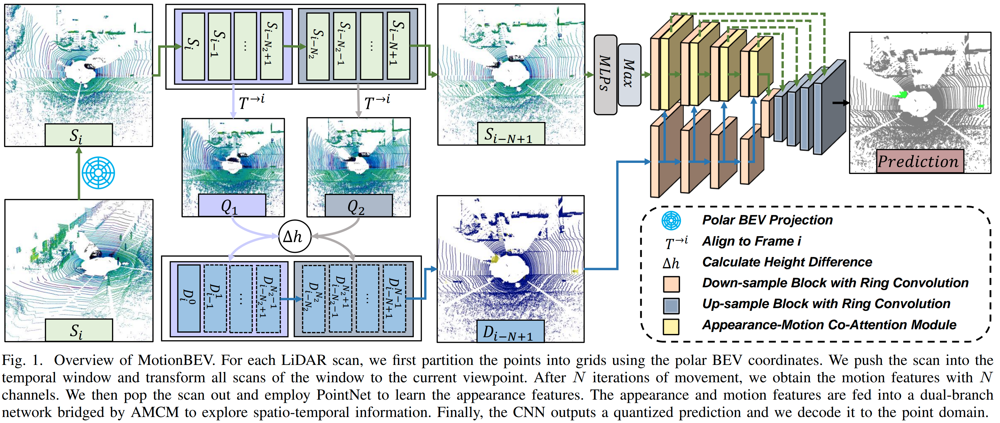

# MotionBEV: Online LiDAR Moving Object segmentation with Bird's eye view based Appearance and Motion Features (RAL'23)
[[**Paper | ArXiv**]](https://arxiv.org/abs/2305.07336)
[[**Paper | IEEEXplore**]](https://ieeexplore.ieee.org/document/10287575)
[[**Video | YouTube**]](https://youtu.be/kOc7gJ72J-g)
[[**Video | Bilibili**]](https://www.bilibili.com/video/BV1Fs4y1G7V2/)

PyTorch implementation for LiDAR moving object segmentation framework **MotionBEV** (RAL'23).

<pre>
B. Zhou, J. Xie, Y. Pan, J. Wu and C. Lu, "MotionBEV: Attention-Aware Online LiDAR Moving Object Segmentation With Bird's Eye View Based Appearance and Motion Features," in IEEE Robotics and Automation Letters, vol. 8, no. 12, pp. 8074-8081, Dec. 2023, doi: 10.1109/LRA.2023.3325687.
</pre>


## Overview
MotionBEV is a simple yet effective framework for LiDAR moving object segmentation. We extract spatio-temporal information from consecutive LiDAR scans in bird's eye view domain, and perform multi-modal features fusion with the multi-modality co-attention modules.
<p align="center">
         
</p>
<p align="center" style="margin-top: -15px;">
    <span style="color:orange; border-bottom: 1px solid #d9d9d9;
        display: inline-block;
        color: #999;
        text-align: center;">Overview of MotionBEV.</span>
</p>

<p align="center">
         
</p>
<p align="center" style="margin-top: -15px;">
    <span style="color:orange; border-bottom: 1px solid #d9d9d9;
        display: inline-block;
        color: #999;
        text-align: center;">Visualization of MOS results on SemanticKITTI validation set.</span>
</p>

MotionBEV is able to perform LiDAR-MOS with both mechanical LIDAR such as Velody HDL-64, and solid-state LiDAR with small Fov and non-repetitive scanning mode, such as Livox Avia.
<p align="center">
         
</p>
<p align="center" style="margin-top: -15px;">
    <span style="color:orange; border-bottom: 1px solid #d9d9d9;
        display: inline-block;
        color: #999;
        text-align: center;">Visualization of MOS results on SipailouCampus validation set.</span>
</p>

## Prerequisites

This code is tested on Ubuntu 18.04 with Python 3.7, CUDA 11.6 and Pytorch 1.13.0.

Install the following dependencies:
* numpy==1.21.6
* [pytorch](https://pytorch.org/get-started/previous-versions/)==1.13.0+cu116
* tqdm==4.65.0
* pyyaml==6.0
* strictyaml==1.7.3
* icecream==2.1.3
* scipy==1.7.3
* [numba](https://github.com/numba/numba)==0.56.4
* [torch-scatter](https://github.com/rusty1s/pytorch_scatter)==2.1.1+pt113cu116
* [dropblock](https://github.com/miguelvr/dropblock)==0.3.0

## Data
### SemanticKITTI
Download SemanticKITTI dataset [here](http://www.semantic-kitti.org/dataset.html#overview). Extract everything into the same folder. 
Data file structure should look like this:

```
path_to_KITTI/
├──sequences
    ├── 00/   
    │   ├── calib.txt   # Calibration file.     
    │   ├── poses.txt   # Odometry poses.
    │   ├── velodyne/	# Unzip from KITTI Odometry Benchmark Velodyne point clouds.
    |   |	├── 000000.bin
    |   |	├── 000001.bin
    |   |	└── ...
    │   └── labels/ 	# Unzip from SemanticKITTI label data.
    |       ├── 000000.label
    |       ├── 000001.label
    |       └── ...
    ├── ...
    └── 21/
    └── ...
```
### KITTI-road
If you want to use KITTI-road dataset, please follow [MotionSeg3D](https://github.com/haomo-ai/MotionSeg3D), and put all extra sequences in the folder: `path_to_KITTI/sequences`.

### Livox-SipailouCampus
We also provide our dataset collected by Livox Avia here [(Google Drive)](https://drive.google.com/file/d/1GnX9CMaH0AjRkkjtOpPv9F5vzqIcUhxR/view?usp=sharing). There are 8 sequences in total, and the data file structure is the same as SemanticKITTI. 

NOTE: DO NOT put the Sipailou sequences in SemanticKITTI's folder.

## Usage
### Prepare the motion features
To speed up training, we first generate motion features for all scans.

Specify paths in [data_preparing_polar_sequential.yaml](utils/generate_residual/config/data_preparing_polar_sequential.yaml)
```shell
scan_folder: 'your_path/path_to_KITTI/'
residual_image_folder: 'your_path/mos/residual-polar-sequential-480-360/'
```
run
```shell
cd utils/generate_residual/utils
python auto_gen_polar_sequential_residual_images.py
```
Then we obtain motion features with N channels for all scans.

*TODO*  
- [ ] The motion features in BEV domain are back-projected to the 3D space after being generated, and projected to the 2D space again when training. 
This consumes a lot of time and space. We'll keep them in the 2D space in the future.
- [ ] CPP implementation for motion features generation.


### Infer
pretrained models:

[MotionBEV-kitti-val-76.54.pt](pretrain/MotionBEV-kitti-val-76.54.pt)  
[MotionBEV-kitti-road-test-74.88.pt](pretrain/MotionBEV-kitti-road-test-74.88.pt)

the filename means: `[model name] - [dataset] - [split] - [IoU]` 

Specify params in [MotionBEV-semantickitti.yaml](config/MotionBEV-semantickitti.yaml)
```shell
data_path: "your_path/path_to_KITTI"
residual_path: "your_path/mos/residual-polar-sequential-480-360/" #"/media/ubuntu/4T/KITTI/mos/residual-polar-sequential-480-360"
model_load_path: "pretain/MotionBEV-kitti-val-76.54.pt"
```

Run
```shell
python infer_SemanticKITTI.py
```
the predictions will be saved in folder `prediction_save_dir`


### Train
You may want to modify these params in [MotionBEV-semantickitti.yaml](config/MotionBEV-semantickitti.yaml)
```shell
data_path: "your_path/path_to_KITTI"
residual_path: "your_path/mos/residual-polar-sequential-480-360/" #"/media/ubuntu/4T/KITTI/mos/residual-polar-sequential-480-360"
model_load_path: ""  # none for training from scratch
batch_size: 8
eval_every_n_steps: 1048  #1411 #1048
drop_few_static_frames: True  # drop_few_static_frames for training, speed up training while slightly reduce the accuracy
```
Run
```shell
python train_SemanticKITTI.py
```


### For Livox
generate motion features:
```shell
cd utils/generate_residual/utils
python auto_gen_livox_sequential_residual_images.py
```
pretained models:  
[MotionBEV-livox-val-89.22.pt](pretrain/MotionBEV-livox-val-89.22.pt)  

infer:
```shell
python infer_livox.py
```
train:
```shell
python train_livox.py
```

### Evaluation
Follow [semantic-kitti-api](https://github.com/PRBonn/semantic-kitti-api).

Or run:
```shell
python utils/evaluate_mos.py -d your_path/path_to_KITTI -p your_path/path_to_predictions -s valid
```

### Visualization
Install [open3d](https://github.com/isl-org/Open3D) for visualization.
```shell
python utils/visualize_mos.py -d your_path/path_to_KITTI -p your_path/path_to_predictions -s 08
```

## Citation
Please cite our paper if this code benefits your research:
```
@ARTICLE{motionbev2023,
  author={Zhou, Bo and Xie, Jiapeng and Pan, Yan and Wu, Jiajie and Lu, Chuanzhao},
  journal={IEEE Robotics and Automation Letters}, 
  title={MotionBEV: Attention-Aware Online LiDAR Moving Object Segmentation With Bird's Eye View Based Appearance and Motion Features}, 
  year={2023},
  volume={8},
  number={12},
  pages={8074-8081},
  doi={10.1109/LRA.2023.3325687}}

```
## Acknowledgment
We thank for the opensource codebases, [PolarSeg](https://github.com/edwardzhou130/PolarSeg)
, [LiDAR-MOS](https://github.com/PRBonn/LiDAR-MOS)
, [MotionSeg3D](https://github.com/haomo-ai/MotionSeg3D)
, [Motion-Guided-Attention](https://github.com/lhaof/Motion-Guided-Attention)
and [AMC-Net](https://github.com/isyangshu/AMC-Net).
