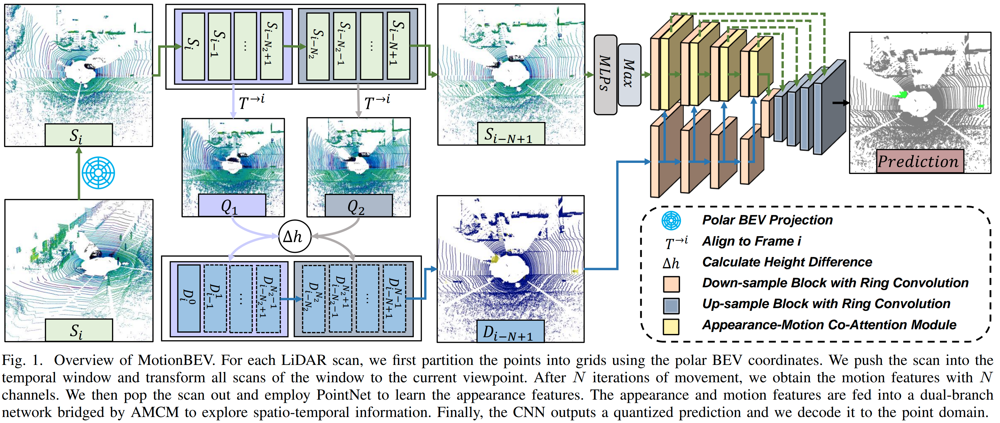
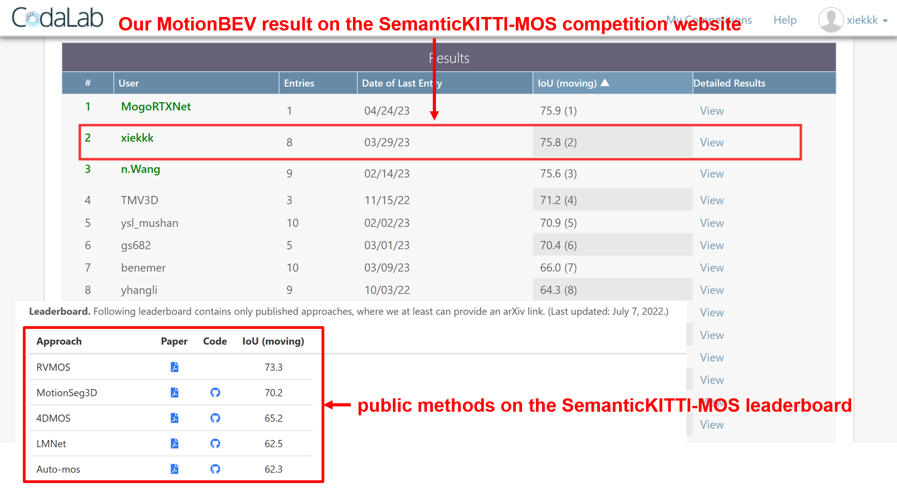

# MotionBEV: Attention-Aware Online LiDAR Moving Object segmentation with Birds' Eye View based Appearance and Motion Features
[[**Paper | ArXiv**]](https://arxiv.org/abs/2305.07336)
[[**Video | YouTube**]](https://youtu.be/kOc7gJ72J-g)
[[**Video | Bilibili**]](https://www.bilibili.com/video/BV1Fs4y1G7V2)

PyTorch implementation for online LiDAR moving object segmentation framework **MotionBEV**.

<pre>
MotionBEV: Attention-Aware Online LiDAR Moving Object segmentation with Birds' Eye View based Appearance and Motion Features.
Bo Zhou* ,Jiapeng Xie* , Yan Pan, Jiajie Wu, and Chuanzhao Lu.
</pre>

**The code and pretrained models are coming soon.**
## Overview
MotionBEV is a fast and accurate framework for LiDAR moving object segmentation. We extract spatio-temporal information from consecutive LiDAR scans in bird's eye view domain, and perform multi-modal features fusion with the multi-modality co-attention modules.

         

    Overview of MotionBEV.

We achieve leading performance on [SemanticKITTI-MOS benchmark](http://semantic-kitti.org/tasks.html#mos), with 75.8% IoU (combined semantics) for moving class and an average inference time of 23ms (on an RTX 3090 GPU). See the [competition website](https://codalab.lisn.upsaclay.fr/competitions/7088).

         

    Screenshots of the rankings on the SemanticKITTI-MOS website.

         

    Visualization of MOS results on SemanticKITTI validation set.

MotionBEV is able to perform LiDAR-MOS with both mechanical LIDAR such as Velody HDL-64, and solid-state LiDAR with small Fov and non-repetitive scanning mode, such as Livox Avia.

         

    Visualization of MOS results on SipailouCampus validation set.

